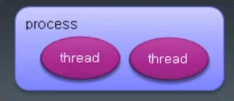
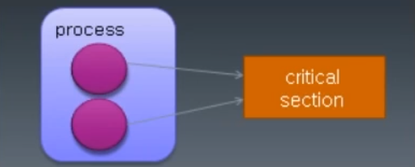
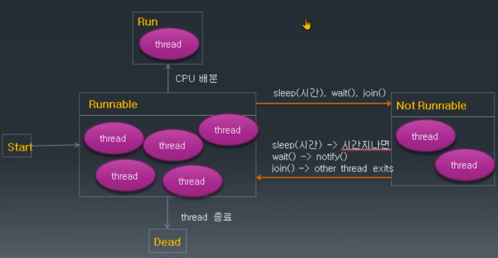

# JAVA에서 Thread 만들기

## Thread란?

- process: 실행 중인 프로그램. 프로그램이 실행되면 OS로부터 메모리를 할당받아 프로세스 상태가 됨.
- thread: 하나의 프로세스는 하나 이상의 thread를 가지게 되고, 실제 작업을 수행하는 단위는 thread임.



## Thread 사용 시기

- JAVA가 요즘 웹 프로그램에서 많이 사용되고 있기 때문에 웹 서버가 보통 thread를 관리하고 멀티 쓰레딩을 하면서 request가 많이 들어오면 여러 thread를 생성해서 처리하기 때문에 JAVA에서 thread를 관리할 필요가 없다.
- Android나 일부 프로그램을 개발하다 보면 thread를 만들 일이 생길 수 있다. thread 간에 메시지를 전송하는 등 어떤 일들을 처리할 일이 있다.

## multi-threading

- 여러 thread가 동시에 수행되는 프로그래밍, 여러 작업이 동시에 실행되는 효과
- thread는 각각 자신만의 작업 공간을 가짐. (context)
- 각 thread 사이에서 공유하는 자원이 있을 수 있음. (자바에서는 static instance)
- 여러 thread가 자원을 공유하여 작업이 수행되는 경우 서로 자원을 차지하려는 race condition이 발생할 수 있음.
- 이렇게 여러 thread가 공유하는 자원 중 경쟁이 발생하는 부분을 critical section이라고 함.
- critical section에 대한 동기화(일종의 순차적 수행)를 구현하지 않으면 오류가 발생할 수 있음.



## 자바 Thread 만들기

Thread 클래스 상속하여 만들기

```java
/**
 * 자바에서 thread를 만드는 방법 2가지
 * 1. Thread 클래스를 상속
 * 2. Runnable 인터페이스를 임플러먼트스(구현)
 */

// 1. Thread 클래스를 상속
class MyThread extends Thread {
    public void run() {
        int i;
        for (i = 1; i <= 200; i++) {
            System.out.print(i + "\t");
        }
    }
}

public class ThreadTest {
    public static void main(String[] args) {
        System.out.println(Thread.currentThread() + "start");

        MyThread th1 = new MyThread();
        MyThread th2 = new MyThread();

        th1.start();
        th2.start();
        System.out.println(Thread.currentThread() + "end");

        // 결과
        // Thread[main,5,main]start
        // Thread[main,5,main]end
        // 1	1	2	2	3	4	3	5	4	6	5	6	7	...

        /**
         * thread 수는 총 3개
         * main, th1, th2
         *
         * 결과를 보면 main 쓰레드가 제일 먼저 끝났고 이어서 th1, th2가 각각 실행된다.
         */
    }
}
```

Runnable 인터페이스 구현하여 만들기

- 자바는 다중 상속을 허용되지 않으므로 이미 다른 클래스를 상속한 겨우 thread를 만들기 위해 Runnable interface를 구현하도록 한다.

```java
/**
 * 자바에서 thread를 만드는 방법 2가지
 * 1. Thread 클래스를 상속
 * 2. Runnable 인터페이스를 임플러먼트스(구현)
 */

// 2. Runnable 인터페이스를 임플러먼트스(구현)
class MyThread2 implements Runnable {
    @Override
    public void run() {
        int i;
        for (i = 1; i <= 200; i++) {
            System.out.print(i + "\t");
        }
    }
}

public class ThreadTest2 {
    public static void main(String[] args) {
        System.out.println(Thread.currentThread() + "start");

        MyThread2 runnable = new MyThread2();

        Thread th1 = new Thread(runnable);
        Thread th2 = new Thread(runnable);

        th1.start();
        th2.start();

        System.out.println(Thread.currentThread() + "end");

        // 결과
        // Thread[main,5,main]start
        // Thread[main,5,main]end
        // 1	1	2	2	3	4	3	5	4	6	5	6	7	...

        /**
         * thread 수는 총 3개
         * main, th1, th2
         *
         * 결과를 보면 main 쓰레드가 제일 먼저 끝났고 이어서 th1, th2가 각각 실행된다.
         */

        // inner class로 생성해서 thread 구현
        Runnable run = new Runnable() {
            @Override
            public void run() {
                System.out.println("run");
            }
        };

        run.run();
    }
}
```

## Thread Status
